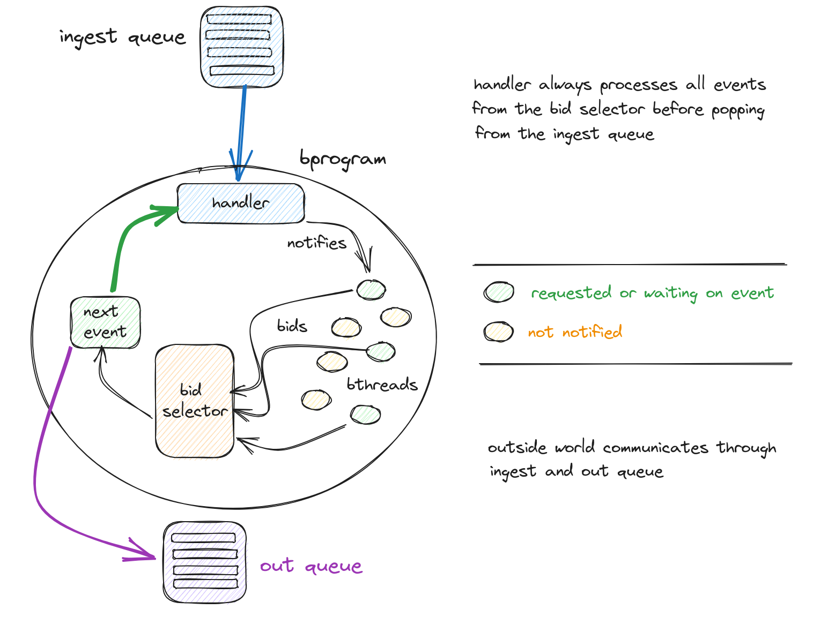

# Pavlov: Behavioral Programming for Clojure

*Status: pre-release.*

[](https://clojars.org/tech.thomascothran/pavlov)

Pavlov is a behavioral programming library for Clojure(Script).

Behavioral programming (BP) is an event-driven programming paradigm that decomplects application behaviors.



## Bthreads

In BP, a unit of application behavior is a bthread. Bthreads can be run in parallel. Bthreads park until an event they are interested in occurs.

Bthreads work by producing bids in a certain kind of pub-sub system -- a bprogram. A bid can:

1. Request events
2. Wait on events
3. Block events

Events may come from an external process. This can be anything: not only a bid from a bthread, but a user action in a UI, an event on a Kafka stream, an HTTP request, etc.

When an event occurs, all bthreads that have either requested that event or are waiting on that event submit their next bid.

## Bprograms

The bprogram will select the next event based on the bids. Any event that is blocked by any bthread will never be selected. Importantly, this means bthreads block events requested by other bthreads.

Bthreads are assigned a priority. The bprogram selects the bthread with a) the highest priority and b) at least one requested event that is not blocked.

If all threads have the same priority, then the bid selection is random.

## Internal and External Events

All events requested by bthreads will be handled before external events.

This means that when an event is submitted to the bprogram, bids will be requested and any events they request will be processed repeatedly until there are no outstanding requested events.

At that point in time, the next external event will be processed.

## Simple Example

Let's suppose we have an industrial process which should have the following behaviors:

1. 3 units of hot water should be added
2. 3 units of cold water should be added
3. The addition of hot and cold water should be interleaved to control the overall temperature.

```clojure
(ns water-controls.app
  (:require [tech.thomascothran.pavlov.bthread :as b]
            [tech.thomascothran.pavlov.bprogram :as bp]))

(def water-app
  (let [add-hot  (b/seq (repeat 3 {:request #{:add-hot-water}}))
        add-cold (b/seq (repeat 3 {:request #{:add-cold-water}}))
        alt-temp (b/seq 
                    (interleave
                       (repeat {:wait-on #{:add-cold-water}
                                :block #{:add-hot-water}})
                       (repeat {:wait-on #{:add-hot-water}
                                :block #{:add-cold-water}})))]
    (bp/make-program [add-hot add-cold alt-temp]))
```

## Creating bthreads

Bthreads are sequential and stateful. They can run in parallel and be parked when they are waiting on events.

The bid a bthread produces can request events, wait on events, or block events in other bthreads. Bthreads do not directly know about each other.

There are two main functions to create bthreads.

- `b/seq`: turn a sequence of bids into a bthread
- `b/reduce`: turn a reducing function and a starting value into a bthread

## Recipes

### Request a simple event

The simplest way to specify an event is as a keyword:

```clojure
(b/seq [{:request {:a}}])
```

This bthread requests an event of type `:a` then halts

### Add more data to an event

Events can also be maps.

For example:

```clojure
{:type :submit
 :form {:first-name "Thomas"}
```

### Compound events

Events need not be an atomic type.

For example, if you are playing tic tac toe, you may have `:x` select the center of the board:

```clojure
{:type [1 1 :x]}
```

### Block until

Combine `:wait` and `:block`:

```clojure
{:wait-on #{:b}
 :block #{:c}
```

Event `:c` is blocked until `:b` occurs.

### Cancel `x` when `y` occurs

Combine `:wait-on` and `:request`:

```clojure
(def bthread-one
  (b/seq [{:wait-on #{:b}
           :request #{:a}}]))

(def bthread-two
  (b/seq [{:block #{:a}
           :wait-on #{:c}}])

```

`bthread-two` blocks event `:a`.

If event `:c` occurs first, then `:a`'s request will succeed. (Assuming it is not blocked by other threads.)

However, if event `:b` occurs before event `:c`, then `:a` is cancelled.

### Terminate the bprogram

When `:c` occurs, close the program.

```clojure
(b/seq [{:wait-on #{:c}}
        {:terminate true
         :type :finis}])
```

## Design Goals

1. *Swappable implementations*. Protocols are used so that bthreads and bprograms are open for extension and modification.
2. *BYO parallelization*. Bthreads can run in parallel and you should choose how. Bring your own thread pool, or use core.async. (TODO)

## Roadmap

1. Implement canonical tic tac toe example in the test suite (done)
2. Abstract event sources and sinks
3. Firm up APIs
4. ClojureScript support (including Squint)
5. Opt-in parallelization
6. Documentation
7. Allow the creation of new bthreads to an active program
8. Derived event types

## Further Reading

- [Behavioral Programming](https://cacm.acm.org/research/behavioral-programming/#R26), by David Harel, Assaf Marron, and Gera Weiss (2012)
- [The Behavioral Programming Web Page](https://www.wisdom.weizmann.ac.il/~bprogram/more.html)
- [Programming Coordinated Behavior in Java](https://www.wisdom.weizmann.ac.il/~/bprogram/pres/BPJ%20Introduction.pdf) by David Harel, Assaf Marron, and Gera Weiss.
- [Documentation and Examples for BPJ](https://wiki.weizmann.ac.il/bp/index.php/User_Guide)

## License

Copyright © 2024 Thomas Cothran

Distributed under the Eclipse Public License version 1.0.
