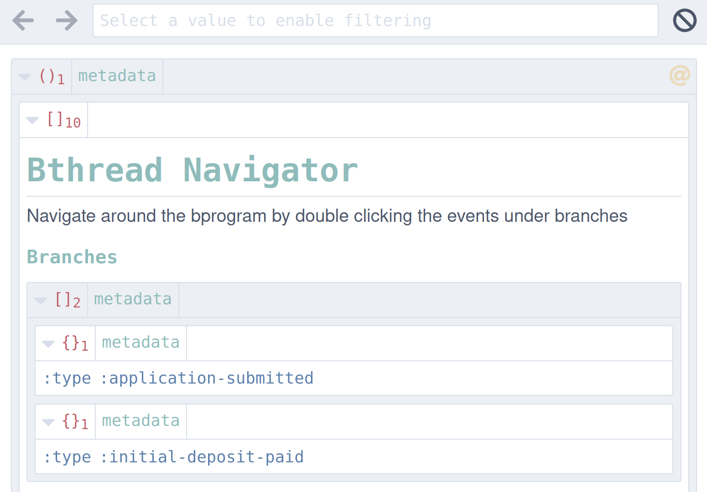
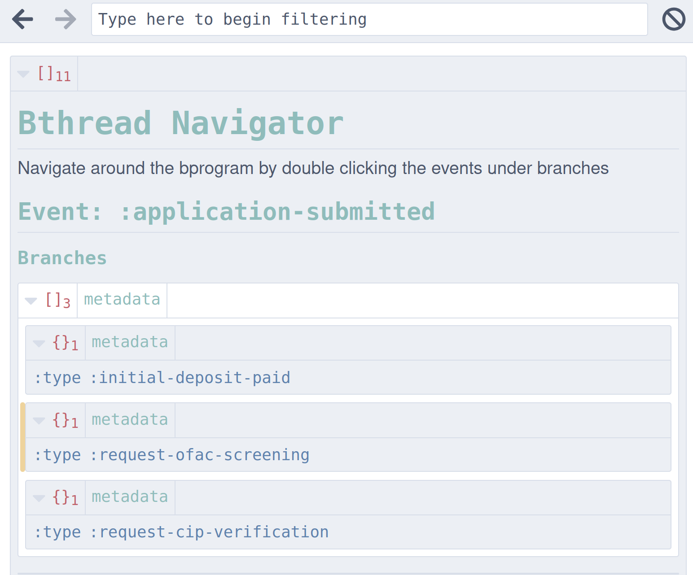
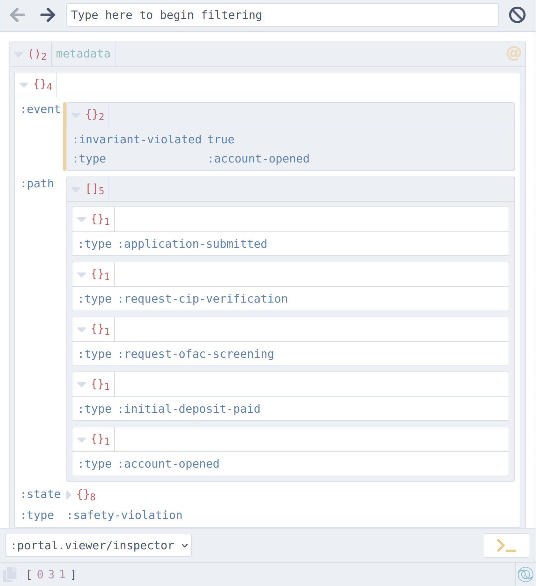

# Designing Business Programs with Bthreads

This tutorial explains how to design business programs using the behavioral programming paradigm. It serves both as a tutorial for writing behavioral programs in pavlov, and as a guide to writing real-world applications with complex business logic.

The core challenge we will be addressing is that business processes are rife with implicit branching, cross-cutting rules, and environment-driven alternatives (credit checks, fraud flags, supervisor overrides). We will see how behavioral programming is a simple approach that lets us:

- Write business rules as isolated, composable units
- Create branching scenarios automatically
- Visualize those branching scenarios with a point-and-click UI
  + You can use this for visualizing your application as you are developing it, for demoing to a domain expert, or for letting an LLM explore the behavior of the your application (via `nav`)
- Run a model checker to verify your program.

You may even be convinced that model-checker-driven development is superior to REPL-driven development!

## What is Behavioral Programming?

Behavioral programming maximizes loose coupling. We use independent behavioral threads (bthreads) for each individual behavior. Bthreads communicate via events: they are notified of the events to which they subscribe, and they communicate by returning bids that request, wait for, and block events.

Behavioral programs (bprograms) compose bthreads, wire up the events so that each bthread is notified when an event to which it is subscribed occurs. Then the bprogram selects the next event, notifying all the bthreads subscribed to those events.

### Selection Algorithm

The next event is selected with the following algorithm:

- Find all the bthreads that are requesting unblocked events
- Order the bthreads in priority order, and select the highest priority bthread
- Order the unblocked requested events from that highest priority bthread, and select the one with the highest priority

If the bthreads or events are of equal priority, the selection is non-deterministic.

Priority order is determined by the collection. If an ordered collection is used, the bids or events are ordered with the highest priority first. If the collection is unordered, then all items have equal priority.

Let's take two bthreads:

```clojure
(require '[tech.thomascothran.pavlov.bthread :as b])

(defn make-bthread-a
  []
  ;; b/bids creates a bthread that requests the bids in the vector
  (b/bids [{:request #{:event-1 :event-2}}])) ;; <- non-deterministic

(defn make-bthread-b
  []
  (b/bids [{:request [:event-3 :event-4]}])) ;; <- ordered priority

(defn make-bthreads-with-priority
  []
  [[:bthread-a (make-bthread-a)]
   [:bthread-b (make-bthread-b)]])

(defn make-bthreads-without-priority
  []
  {:bthread-a (make-bthread-a)
   :bthread-b (make-bthread-b)})
```

Most of the time, you do not need a priority order. By making requests for events of equal priority, we can create a *branch* in execution paths.

### Program Lifecycle

The behavioral program will continue to select the next event and then notify each subscribed bthread until

1. there are no requested, unblocked events, or
2. an event is selected that has `:terminal` set to `true`

At that point, if you used `tech.thomascothran.pavlov.bprogram.ephemeral/execute!`, the promise will be delivered with the terminal event. In the case of there being no remaining events, a deadlock event is delivered. In the case of a `:terminal` event, that terminal event is delivered.

Generally, you want to use a `:terminal` event to close the bprogram. Bprograms may be executed as a function call.

Bprograms may be run in other ways: as a long-running process that listens for events, as a durable program that parks and is serialized to disk, until the next event occurs. Those options are outside the scope of this tutorial.

## Domain

Quality business applications need to express the domain. Imagine building a banking application, and using event storming to identify the following events that occur when a new customer wants to open an account.

- `:application-submitted` - the event that starts the process
- `:request-cip-verification` - verify the identity of the applicant. This can result in:
  + `:cip-verified`
  + `:cip-failed`, which should result in the `:application-declined` event
- `:ofac-screen-requested` - ensure the customer is not on the sanctions list
  + `:ofac-hit` should result in the `:application-declined` event
  + `:ofac-clear`
- `:initial-deposit-requested` after cip verification and clearance through OFAC

Of course, we know that the business rules are more complex, but this gives us a starting point.

Now we move on to our business rules. Some business rules pertain to order:

1. `:request-cip-verification` must occur (and either succeed or fail) before `:initial-deposit-requested`.
2. `:ofac-screen-requested` must be done before account creation.

Other business rules regard necessary relationships between events:

1. If `:cip-failed` happens, then `:application-declined` must follow
2. If `:ofac-hit` happens, then `:application-declined` must follow,


### Domain Rules Bthreads

Let's create our domain rules bthreads.

```clojure
(ns demo.bank.domain
  (:require [tech.thomascothran.pavlov.bthread :as b]
            [tech.thomascothran.pavlov.viz.portal :as pvp]
            [tech.thomascothran.pavlov.model.check :as check]))

(defn make-request-cip-verification-bthread
  []
  (b/bids [{:wait-on #{:application-submitted}}
           {:request #{{:type :request-cip-verification}}}]))

(defn make-request-ofac-screening-bthread
  []
  (b/bids [{:wait-on #{:application-submitted}}
           {:request #{{:type :ofac-screening-requested}}}]))
```

When an application is submitted, then we request CIP verification and OFAC screening. We need to decline the application if either returns a negative result:

```clojure
(defn make-cip-failure-rule-bthread
  []
  (b/on :cip-failed
        (constantly
         {:request #{{:type :application-declined}}})))

(defn make-ofac-hit-rule-bthread
  []
  (b/on :ofac-hit
        (constantly
         {:request #{{:type :application-declined}}})))
```

We can't forget to request our initial deposit:

```clojure
(defn make-request-initial-deposit-bthread
  []
  (b/bids [{:request #{{:type :initial-deposit-requested}}}]))
```

But wait! Don't we have rules about when to request that deposit?

We do, but these rules should be decoupled. Some policies about when the initial deposit may be mandatory. Others may change. The rules about when the initial deposit should be requested should be able to change independently as policies and regulations change.

So we add separate rules:


```clojure
(defn make-block-deposit-until-cip-verified
  []
  (b/bids [{:block #{:initial-deposit-requested}
            :wait-on #{:cip-verified}}]))

(defn make-block-opening-until-ofac-cleared
  []
  (b/bids [{:block #{:initial-deposit-requested}
            :wait-on #{:ofac-clear}}]))
```

We *block* the request for an initial deposit until the CIP verification event and OFAC clearance event occurs. The bank policy could change to permit requesting the initial deposit before the OFAC screen clears, so long as the account is not opened first.

Note that we can change this business rule in one place, without complecting rules in a `cond` expression.

We need a few more business rules:

```clojure
(defn make-open-on-funding-bthread
  []
  (b/bids [{:wait-on #{:initial-deposit-paid}}
           {:request #{{:type :account-opened}}}]))
```

Now, we want to verify our system is correct. For that, we will need a few more bthreads.

### Environment Bthreads

Environment bthreads request events that come from the environment (i.e., from actions outside the system).

Crucially, this lets us introduce branches:

```clojure
(defn make-environment-bthreads
  []
  {::application-submitted
   (b/bids [{:request #{{:type :application-submitted}}}])

   ::pay-deposit
   (b/bids [{:request #{{:type :initial-deposit-paid}}}])})
```

We request events that happen when the customer submits their application and when they pay the initial deposit.

Note that we are using these environment bthreads to *simulate* events; we would not use these bthreads outside of a test context.

By requesting *both* alternatives in an unordered collection, we indicate that either event can occur. This lets us use Pavlov's bthread explorer to click through the execution paths of our application.

#### Pavlov Bprogram Visualizer

Pavlov has a built-in visualizer for bprograms that lets us see the bthreads and their states as the program executes.


The visualizer exports as an html file:

```clojure
(do (require '[tech.thomascothran.pavlov.viz.cytoscape-html :as ch])
    (require '[tech.thomascothran.pavlov.graph :as graph])

    (def btrds
      (reduce into
              (safety-bthreads-v1)
              [(make-bthreads-v1)
               (make-environment-bthreads-v1)]))

    (spit "bank-rules.html"
          (-> (graph/->lts btrds)
              (ch/lts->html))))
```

#### Pavlov Program Explorer

Using `nav`, we can open up our bthreads in Portal and click through all the diverging paths. Or you (or an LLM) can use nav at the REPL.

So we add a comment block:

```clojure

(comment
  (require '[portal.api :as portal])

  (do (def p (portal/open))
      (add-tap #'portal/submit))

  (-> (reduce into (safety-bthreads-v1)
              [(make-bthreads-v1)
               (make-environment-bthreads-v1)])

      (pvp/bthreads->navigable)
      (tap>)))
```

And we see the bthread explorer:



By leveraging Portal's nav support, we can select an event and move the application down that execution path. Let's double-click `:application-submitted`.



We can use the back button to go back, and then follow a different execution path.

If you are observant, you might notice that we have a bug. We can find these automatically, using pavlov's model checking.

For that, we will need to introduce another way we can use bthreads: as expressing invariants.

### Safety Bthreads

Safety bthreads are used to detect things that should not happen.

For example, we might have a rule that says that an account should not be opened unless the ofac screen has cleared.

```clojure
(defn make-account-opening-requires-ofac-screening-bthread
  []
  (b/bids [{:wait-on #{:account-opened}}
           {:wait-on #{:ofac-clear}
            :request #{{:type :account-opened
                        :invariant-violated true}}}]))
```

This bthread can be read as:

- When the account is opened
- Try to open the account
- Until the OFAC screen clears.

The `:invariant-violated` property tells our model checker that this specific event should not be selected.

If the `:ofac-clear` event occurs, then this bthread will no longer request the account-opened event with an invariant violation. Another bthread may request the `account-opened` event, but (so long as that event does not have `:invariant-violated` set to true) the model checker will accept it as valid.

### Model Checking

We're going to wrap our bthreads into function calls to construct the domain, environment, and safety bthreads:

```clojure
(defn make-bthreads-v1
  []
  {::request-cip-verification-bthread
   (make-request-cip-verification-bthread)

   ::request-ofac-screening-bthread
   (make-request-ofac-screening-bthread)

   ::cip-failure-rule-bthread
   (make-cip-failure-rule-bthread)

   ::ofac-hit-rule-bthread
   (make-ofac-hit-rule-bthread)

   ::request-initial-deposit-bthread
   (make-request-initial-deposit-bthread)

   ::block-deposit-until-cip-verified
   (make-block-deposit-until-cip-verified)

   ::block-opening-until-ofac-cleared
   (make-block-opening-until-ofac-cleared)

   ::open-on-funding
   (make-open-on-funding-bthread)})

(defn make-environment-bthreads-v1
  []
  {::application-submitted
   (b/bids
    [{:request #{{:type :application-submitted}}}])
   ::pay-deposit
   (b/bids [{:request #{{:type :initial-deposit-paid}}}])})

(defn safety-bthreads-v1
  []
  {::account-opening-requires-ofac-screening
   (make-account-opening-requires-ofac-screening-bthread)})
```

Now, let's see what our model checker has to say. If it returns `nil`, then no violation was found.

```clojure
(comment
  (-> {:bthreads (make-bthreads-v1)
                :environment-bthreads (make-environment-bthreads-v1)
                :safety-bthreads (safety-bthreads-v1)
                :check-deadlock? false}
     (check/check)
     tap>))
```

Here, however, we see there was a violation, and we know the exact execution path:



The model checker provides not only the path, but the state of the bthreads, which is very useful for debugging. (LLMs work great with this as well.)

To get our model to pass the check, we add another bthread and re-run the model checker. This becomes our iterative cycle: add safety properties, run the model checker, and the model checker will indicate the next bthread to be written.

# Append-Only Programming

Because our business rules are naturally decoupled, we are free to compose them as we like. For example, some domain bthreads may be used both by consumer and business account openings. Again, some rules apply to both initial deposits and ordinary deposits.

Further, we would append other types of bthreads that do IO, such as read or write to a database or make API calls. Because bthreads are composed, during unit testing we can simply use environment bthreads to simulate the possible results from a database call, and only use the IO bthread in QA and production environments.

Check the examples directory for the full code.
